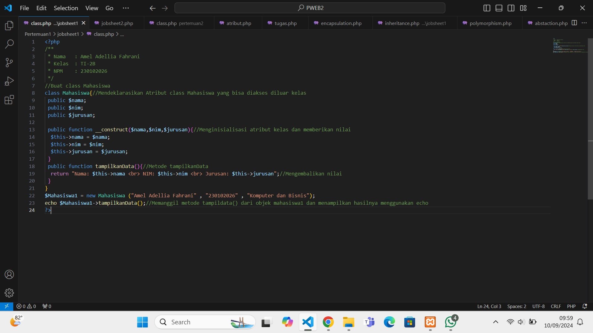

# PWEB2
Repository ini dibuat untuk memenuhi tugas mata kuliah praktikum pemrograman web II.

**Nama   : Amel Adellia Fahrani  
Kelas    : TI-2B  
NPM      : 230102024**

## Materi yang dipelajari :
Object Oriented Programming (OOP) adalah Paradigma pemrograman yang berfokus pada koonsep object. Program disusun dengan mengelompokkan objek-objek yang mewakili entitas. Setiap objek memiliki atribut dan metode yang berinteraksi dengan objek lain.Paradigma ini berfokus pada bagaimana objek-objek tersebut berinteraksi satu sama lain dan bagaimana mereka berfungsi dalam sistem. Prinsip darsar OOP meliputi:
- Encapsulation 
- Inheritance
- Polymorphism
- Abstraction
## Jobsheet 1 (Modul 1-2)
### 1. Membuat class dan object
```php
class Mahasiswa{
 public $nama;
 public $nim;
 public $jurusan;
```
Mendeklarasikan kelas dengan nama Mahasiswa dengan atributnya nama,nim dan jurusan yang bisa diakses secara publik artinya bisa diakses diluar kelas.
```php
public function __construct($nama,$nim,$jurusan)
  $this->nama = $nama;
  $this->nim = $nim;
  $this->jurusan = $jurusan;
 }
```
 Metode ini digunakan untuk menginisialisasi atribut kelas dengan nilai yang diberikan saat objek diciptakan.

```php
public function tampilkanData(){
  return "Nama: $this->nama <br> NIM: $this->nim <br> Jurusan: $this->jurusan";
 }
}
```
Method untuk menampilkan class. Metode publik untuk mengembalikan nilai string informasi mengenai mahasiswa dan menggabungkan nilai atribut nama, nim, dan Jurusan.

```php
$Mahasiswa1 = new Mahasiswa ("Amel Adellia Fahrani" , "230102026" , "Komputer dan Bisnis");
echo $Mahasiswa1->tampilkanData();
?>
```
Membuat instansi objek dari kelas Mahasiswa dengan parameter yang diberikan (nama, nim, dan jurusan). Menampilkan data kelayar dengan echo



### 1. Encapsulation
Enkapsulasi adalah konsep untuk membantu dalam menyembunyikan dan membungkus detail internal dari objek dengan menggunakan atribut privat dan metode publik (getter dan setter).

_Getter_ adalah metode yang digunakan untuk mengambil nilai dari atribut privat   
_Setter_ adalah metode yang digunakan untuk memperbarui nilai dari atribut privat
```php
class Mahasiswa//Deklarasi class Mahasiswa
{
  private $nama;
  private $nim;
  private $jurusan;
```
Deklarasi kelas dengan nama mahasiswa beserta atributnya yaitu nama,nim dan jurusan secara privat artinya atribut haya dapat diakses oleh kelas itu saja.
```php
public function __construct($nama, $nim,$jurusan)
  {
    $this->nama = $nama;
    $this->nim = $nim;
    $this->jurusan = $jurusan;
  }
```
Memanggil method construct(menginisialisasi) atribut nama, nim, dan jurusan ketika objek baru dari kelas mahasiswa dibuat.
```php
public function getNama()
  {
    return "Nama : $this->nama";
  }
  public function getNIM()
  {
    return "NIM : $this->nim";
  }
  public function getJurusan()
  {
    return "Jurusan : $this->jurusan";
  }
```
Method yang digunakan untuk mengambil nilai dari atribut privat, maka kode diatas digunakan untuk mengambil nilai dari atribuut nama, nim, dan jurusan.
```php
 public function setNama($nama)//Metode setter digunakan untuk mengubah nilai atribut
  {
    $this->nama = $nama;
  }
  public function setNIM($nim)
  {
    $this->nim = $nim;
  }
  public function setJurusan($jurusan)
  {
    $this->jurusan = $jurusan;
  }
}
```
Method setter digunakan untuk mengubah nilai dari atribut.
```php
$Mahasiswa1 = new Mahasiswa("Amel Adellia Fahrani<br>", "230102026<br>" , "Komputer dan Bisnis<br>");
```
Mahasiswa1 adalah objek baru dari kelas mahasiswa dengan nilai awal untuk atribut nama,nim,kelas.
```php
echo $Mahasiswa1->getNama();
echo $Mahasiswa1->getNIM();
echo $Mahasiswa1->getJurusan();
```
Memanggil metode getter untuk mendapatkan nilai atribut nama, NIM dan Jurusan.
```php

$Mahasiswa1->setNama("Fahranni<br>");
$Mahasiswa1->setNIM("230102011<br>");
$Mahasiswa1->setJurusan("Komunikasi");
```
Method setter digunakan untuk mengubah nilai dari atribut Nama, NIM dan Jurusan.
```php
echo $Mahasiswa1->getNama();
echo $Mahasiswa1->getNIM();
echo $Mahasiswa1->getJurusan();
```
Dengan kode diatas akan menampilkan nilai baru untuk atribut Nama, NIM dan Jurusan


